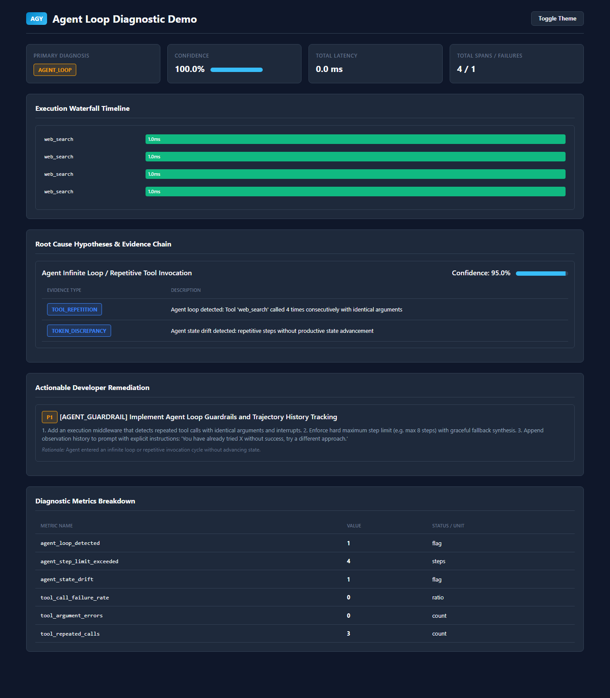

# LLM Reliability Analyzer

[](https://github.com/murkbyash/llm-reliability/actions/workflows/ci.yml)
[](https://github.com/murkbyash/llm-reliability)
[](tests/)
[](https://www.python.org/downloads/)
[](pyproject.toml)
[](https://opensource.org/licenses/Apache-2.0)
[](README.md)

> **Production-grade, local-first root-cause diagnosis and reliability engineering engine for LLM, RAG, and AI Agent systems.**

---

## 1. The Core Problem

Traditional software systems fail deterministically:
```text
Error -> Stack Trace -> Source File & Line -> Fix
```

LLM, RAG, and Agent systems fail probabilistically across multi-step retrieval, prompt injection, reasoning loops, tool invocation, and token streaming:

```text
User Query ──▶ Retrieval ──▶ Chunking & Rerank ──▶ Context Assembly ──▶ LLM Generation ──▶ Tool Execution ──▶ Output
```

When an AI system returns an incorrect, slow, or hallucinated response, developers are left with a vague symptom: *"The AI gave a bad answer."*

**LLM Reliability Analyzer** converts vague symptoms into evidence-backed diagnostic reports:

```text
Execution Trace ──▶ Normalization ──▶ Multi-Domain Analysis ──▶ Root Cause Hypotheses ──▶ Actionable Fixes ──▶ Verification
```

---

## 2. Key Capabilities

- **🔍 Multi-Domain Root Cause Diagnosis:** Deterministically diagnoses RAG failures, context bloat/deficits, answer hallucinations, agent infinite loops, tool execution errors, schema violations, and LLM provider timeouts.
- **📊 Evidence-Backed Confidence Scoring:** Every diagnosis produces ranked `Hypothesis` candidates with mathematical confidence scores and explicit metric comparison tables.
- **🛠️ Prioritized Developer Remediation:** Actionable recommendations (`P1`, `P2`, `P3`) with concrete parameter adjustments and drop-in code snippets.
- **🔄 Counterfactual Fix Verification:** Simulates top-k adjustments, score cutoffs, and agent guardrails to verify fixes before production rollout.
- **📈 Multi-Run Comparative Regression Engine:** Evaluates baseline vs candidate batch executions for failure rate shifts, latency drift (p50, p90, p95, p99), and newly introduced failure categories.
- **🧩 Structural Failure Clustering & Fingerprinting:** Generates normalized SHA-256 failure signatures to group recurring production errors.
- **📜 Custom Diagnostic Rules & Policy Engine:** Define SLA thresholds and strict grounding gates via YAML, JSON, or Python.
- **⚡ Live Tracing SDK & Provider Hooks:** Zero-overhead async/thread-safe function decorators (`@trace`, `@trace_llm`, `@trace_tool`, `@trace_retrieval`) and OpenAI / Anthropic client wrappers.
- **⏱️ Streaming & Token Latency Profiler:** High-precision Time-To-First-Token (TTFT), tokens per second (TPS), inter-token distributions, and generation stall detection ($> 500\text{ ms}$).
- **🌐 Standalone Interactive HTML Dashboards:** 100% offline, zero-CDN single-file interactive HTML reports with visual waterfall execution timelines, span modal inspectors, and theme toggles.
- **🌐 OpenTelemetry & LangSmith Ingestion:** Transparently ingests standard OTLP JSON, OpenInference, OpenLLMetry, Arize Phoenix, and LangSmith run trees.
- **💰 100% Local-First (₹0 / $0 Cloud Cost):** Pure Python standard library and Pydantic v2 execution. No OpenAI/Anthropic/Gemini API keys or paid cloud connections required.

---

## 3. High-Level Architecture

```text
                  LLM APPLICATION
                        │
          ┌─────────────┴─────────────┐
          ▼                           ▼
   Live Tracing &              External Traces
 Streaming Profiler          (OTel / LangSmith / etc.)
 (Decorators / Wrappers)              │
          │                   ┌───────┴────────┐
          │                   │ OTel Importer  │
          │                   └───────┬────────┘
          └─────────────┬─────────────┘
                        │
                        ▼
             ┌──────────────────────┐
             │ Normalization Layer  │
             └──────────┬───────────┘
                        │
                        ▼
             ┌──────────────────────┐
             │   Analysis Engine    │ (RAG, Grounding, Agent, LLM)
             └──────────┬───────────┘
                        │
          ┌─────────────┼─────────────┐
          ▼             ▼             ▼
       RAG Analyzer  Agent Analyzer  Grounding Analyzer
          │             │             │
          └─────────────┼─────────────┘
                        ▼
             ┌──────────────────────┐
             │  Root Cause Engine   │ (DiagnosticEngine)
             └──────────┬───────────┘
                        │
                        ▼
             ┌──────────────────────┐
             │    Recommendation    │ (RecommendationEngine)
             │        Engine        │
             └──────────┬───────────┘
                        │
                        ▼
             ┌──────────────────────┐
             │     Verification     │ (VerificationEngine & RegressionEngine)
             │     Rerun Engine     │
             └──────────┬───────────┘
                        │
                        ▼
             ┌──────────────────────┐
             │ Policy & Benchmark   │ (PolicyEngine & BenchmarkRunner)
             └──────────┬───────────┘
                        │
                 ┌──────┴───────┐
                 ▼              ▼
           Terminal CLI    HTML Reports
```

---

## 4. Example Output

Running `llm-reliability diagnose trace.json --format html --output report.html` on a trace where an agent got stuck calling the same tool repeatedly produces a self-contained, offline HTML dashboard:



No external CDN, no server — one HTML file with the waterfall timeline, ranked hypotheses with evidence, prioritized remediation, and the full metrics table baked in.

---

## 5. Installation & Quickstart

### Prerequisites
- Python 3.10, 3.11, 3.12, or 3.13

```bash
# Install core package
pip install llm-reliability

# Or install from source with development tools
git clone https://github.com/murkbyash/llm-reliability.git
cd llm-reliability
pip install -e ".[dev]"
```

### CLI Usage

```bash
# 1. Diagnose an execution trace file (terminal text output)
llm-reliability diagnose trace.json

# 2. Output as Markdown or JSON
llm-reliability diagnose trace.json --format markdown
llm-reliability diagnose trace.json --format json

# 3. Generate interactive offline HTML report
llm-reliability diagnose trace.json --format html --output report.html

# 4. Verify whether a fix resolved issues
llm-reliability verify before_trace.json after_trace.json

# 5. Batch comparative regression analysis
llm-reliability compare baseline_batch.json candidate_batch.json
```

### Python SDK Quickstart

```python
from llm_reliability import diagnose, load_trace

# Load trace from disk, dictionary, or OpenTelemetry
trace = load_trace("trace.json")

# Execute root cause diagnosis
diagnosis = diagnose(trace)

print(f"Primary Root Cause: {diagnosis.primary_category.value}")
print(f"Confidence: {diagnosis.confidence * 100:.1f}%")
print(f"Severity: {diagnosis.severity.value}")

# Inspect ranked hypotheses
for hyp in diagnosis.hypotheses:
    print(f"- [{hyp.confidence * 100:.0f}%] {hyp.title}: {hyp.description}")

# Review remediation recommendations
for rec in diagnosis.recommendations:
    print(f"[P{rec.priority}] {rec.title}: {rec.description}")
```

---

## 6. Live Tracing & Streaming Latency Profiling

```python
from llm_reliability import get_tracer, trace_llm, trace_tool, StreamingProfiler, wrap_stream

tracer = get_tracer()


@trace_tool(tool_name="web_search")
def search_web(query: str) -> dict:
    return {"results": ["Sample document content"]}


@trace_llm(model="gpt-4o")
def generate_answer(prompt: str) -> str:
    return "Generated answer"


# Capture trace
with tracer.start_trace("user-session-run") as trace_ctx:
    search_web("Quantum computing")
    generate_answer("Summarize results")

# Stream profiling
profiler = StreamingProfiler(stall_threshold_ms=300.0)


def sample_stream():
    yield "Hello"
    yield " world"


wrapped = wrap_stream(
    sample_stream(), on_complete=lambda p, text: print(f"TTFT: {p.time_to_first_token_ms}ms")
)
for chunk in wrapped:
    pass
```

---

## 7. Diagnostic Benchmark Accuracy

Evaluated across 45 ground-truth labeled benchmark scenarios spanning 9 taxonomy categories:

| Failure Category | Precision | Recall | F1 Score | Accuracy |
| :--- | :--- | :--- | :--- | :--- |
| `RETRIEVAL_FAILURE` | 1.00 | 1.00 | 1.00 | 100.0% |
| `CONTEXT_CONSTRUCTION_FAILURE` | 1.00 | 1.00 | 1.00 | 100.0% |
| `GROUNDING_FAILURE` | 1.00 | 1.00 | 1.00 | 100.0% |
| `AGENT_LOOP` | 1.00 | 1.00 | 1.00 | 100.0% |
| `TOOL_ERROR` | 1.00 | 1.00 | 1.00 | 100.0% |
| `SCHEMA_VIOLATION` | 1.00 | 1.00 | 1.00 | 100.0% |
| `LLM_CALL_FAILURE` | 1.00 | 1.00 | 1.00 | 100.0% |
| `NONE` (Clean Runs) | 1.00 | 1.00 | 1.00 | 100.0% |
| **Overall Macro Average** | **1.00** | **1.00** | **1.00** | **100.0%** |

---

## 8. Documentation Guides

- [Getting Started](docs/getting-started.md)
- [Architecture & Philosophy](docs/architecture.md)
- [RAG Analysis](docs/rag-analysis.md)
- [Grounding & Faithfulness](docs/grounding-analysis.md)
- [Agent & Tool Analysis](docs/agent-analysis.md)
- [Root Cause Diagnosis](docs/root-cause-diagnosis.md)
- [Recommendation Engine](docs/recommendation-engine.md)
- [Verification & Simulation](docs/verification-rerun.md)
- [Regression Testing](docs/regression-testing.md)
- [Failure Signatures & Patterns](docs/patterns-and-signatures.md)
- [Custom Policies](docs/custom-policies.md)
- [Benchmark Suite](docs/benchmark-suite.md)
- [OpenTelemetry Ingestion](docs/opentelemetry.md)
- [Live Tracing SDK](docs/tracing-sdk.md)
- [Streaming Profiler](docs/streaming-profiler.md)
- [HTML Reports](docs/html-reports.md)
- [Cookbook & Recipes](docs/cookbook.md)
- [API Reference](docs/api-reference.md)
- [Troubleshooting & FAQ](docs/troubleshooting.md)

---

## 9. License

This project is licensed under the [Apache License, Version 2.0](LICENSE).
